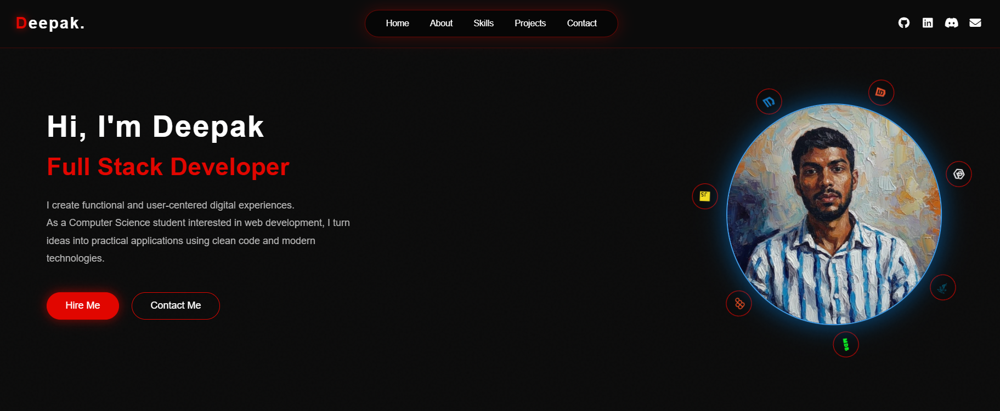
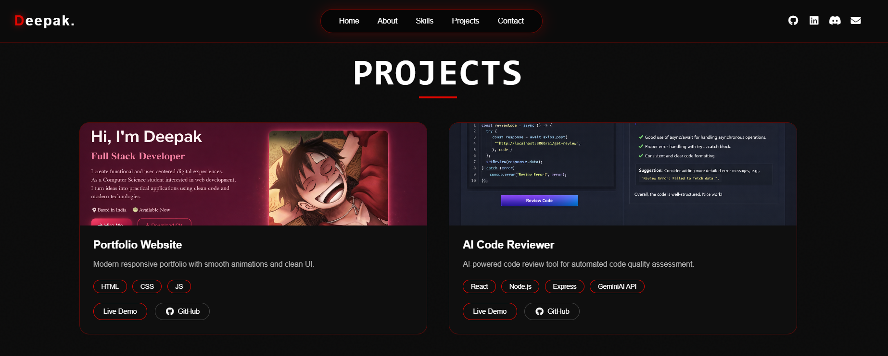
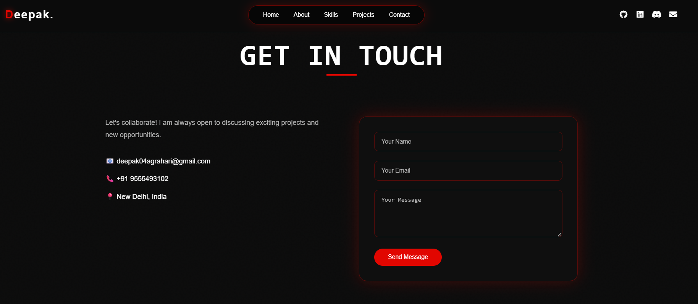

# 🚀 Deepak's Portfolio Website

A modern, fully responsive **personal portfolio website** built to showcase my skills, projects, and experience as a **Full Stack Developer**.
Designed with a focus on **clean UI, smooth animations, and interactive user experience**.

---

## 🌐 Live Demo

🔗 https://deepak04portfolio.netlify.app

---

## 📌 Overview

This portfolio highlights my journey as a developer, featuring:

* Interactive UI with custom cursor animations 🎯
* Smooth scroll-based section reveal effects ✨
* Fully responsive design for all devices 📱
* Functional contact form with EmailJS integration 📩

---

## 🛠️ Tech Stack

### 💻 Frontend

* HTML5
* CSS3 (Advanced animations & responsive design)
* JavaScript (Vanilla JS)

### ⚙️ Tools & Libraries

* Font Awesome (Icons)
* EmailJS (Contact form integration)
* Intersection Observer API (Lazy loading animations)

---

## ✨ Key Features

### 🎨 UI/UX

* Modern dark-themed design
* Glassmorphism navbar
* Animated skill badges
* Hover effects & transitions

### 🧠 Interactivity

* Custom animated cursor using `<canvas>`
* Smooth section reveal on scroll
* Dynamic project cards

### 📩 Contact System

* Integrated **EmailJS**:

  * Sends message to you
  * Auto-reply to user
* Form validation included

### 📱 Responsive Design

* Optimized for:

  * Desktop 💻
  * Tablet 📱
  * Mobile 📲

---

## 📂 Project Structure

```bash
portfolio/
│── index.html
│── style.css
│── images/
│   ├── profile images
│   ├── project screenshots
│── README.md
```

---

## ⚙️ Installation & Setup

1. Clone the repository:

```bash
git clone https://github.com/deepak-agrahari04/portfolio.git
```

2. Navigate to the folder:

```bash
cd portfolio
```

3. Open in browser:

```bash
Open index.html
```

---

## 🔥 Advanced Concepts Used

* Canvas API for cursor animation
* Intersection Observer for lazy loading
* CSS Variables for theme management
* Flexbox & Grid for layout
* Responsive Media Queries

---

## 📸 Screenshots

### 🏠 Home Page


### 💼 Projects Section


### 📩 Contact Section


---

## 📬 Contact

* 📧 Email: [deepak04agrahari@gmail.com](mailto:deepak04agrahari@gmail.com)
* 💼 LinkedIn: https://www.linkedin.com/in/deepak-agrahari
* 🧑‍💻 GitHub: https://github.com/deepak-agrahari04

---

## 🚀 Future Improvements

* Add backend for form handling (Node.js)
* Add blog section
* Improve performance & SEO
* Add dark/light mode toggle

---

## ⭐ Contribution

If you like this project:

* ⭐ Star the repo
* 🍴 Fork it
* 🛠️ Contribute

---

## 📄 License

This project is licensed under the **MIT License**.

---

## 💡 Author

**Deepak**
Full Stack Developer | CSE Student

---
